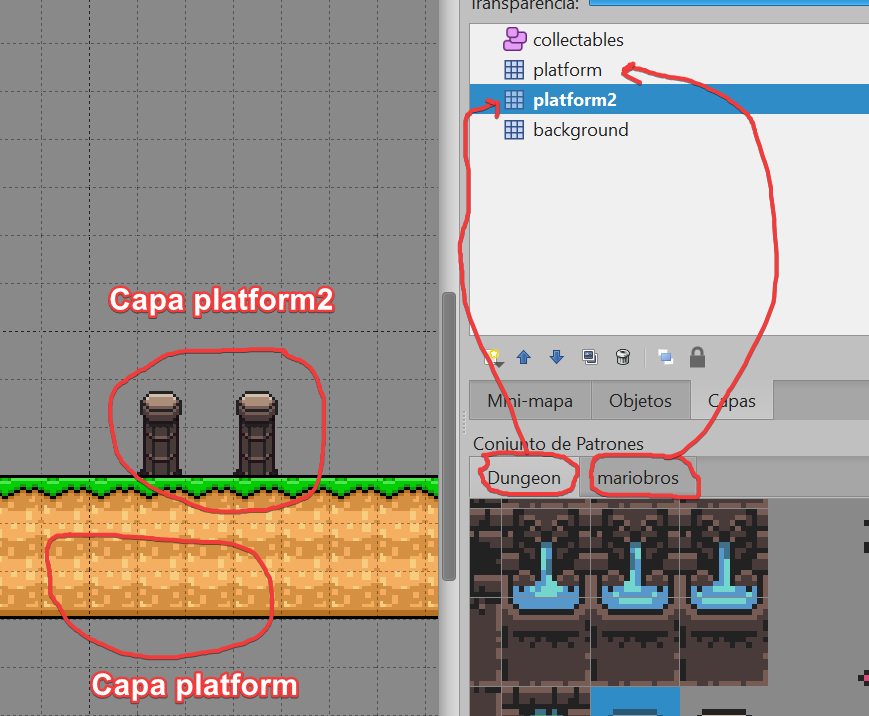
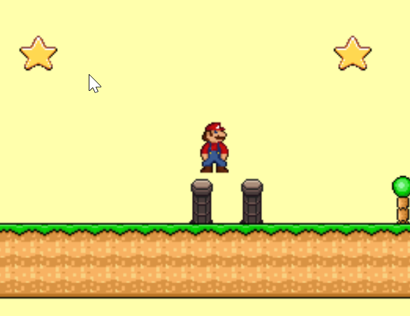
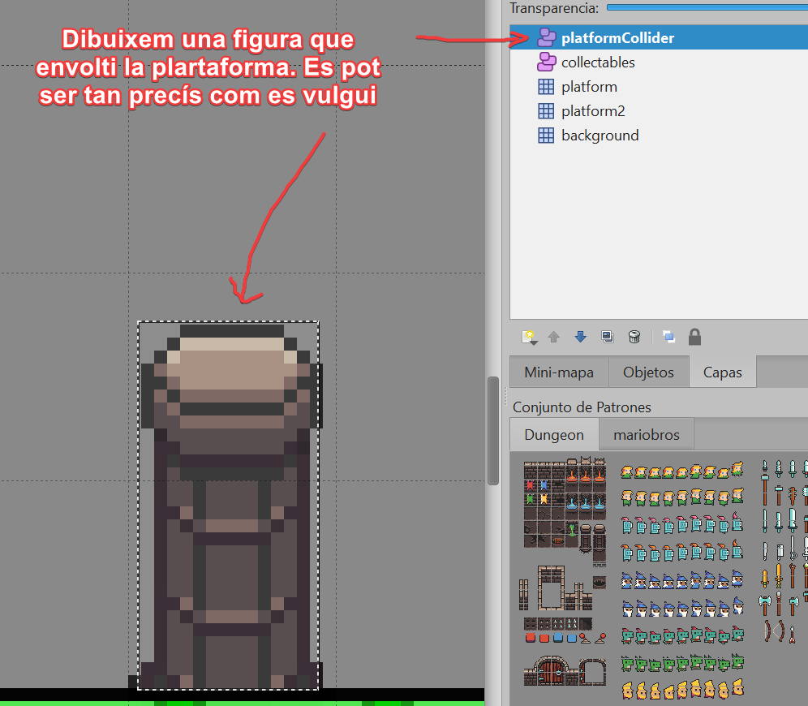

# Preguntes i Respostes 

En aquest apartat us aniré incloent les respostes a preguntes que m'aneu fent a classe

## Pregunta 1

Tinc més d'un gràfic amb els patrons (tiles). Com els utilitzo amb Tiled?

### Resposta

Pel que he investigat, amb Tiled es poden afegir més d'un patró a un sol mapa, però a l'hora de posar-lo amb el codi no acaba de funcionar correctament. 

És a dir, un codi del tipus:

```
const map = this.add.tilemap('tilemap');
const tileset = map.addTilesetImage('mariobros', 'marioTiles');
map.addTilesetImage('Dungeon', 'dungeonTiles');
```

No implica que es vagin afegint patrons. En realitat no els afegirà.

La forma correcta , de moment, és crear diferents capes. Una per tileset que utilitzem

<br/><br/>

I al codi afegir les dues capes

- Al mètode **preload**:

```
this.load.image('marioTiles', 'assets/maps/tiles.png');
this.load.image('dungeonTiles', 'assets/maps/Dungeon.png');
```
- Al mètode **create**:

```
const tileset = map.addTilesetImage('mariobros', 'marioTiles');
const tileset2 = map.addTilesetImage('Dungeon', 'dungeonTiles');
//....
const plataforma2_layer = map.createLayer('platform2', tileset2)
const plataforma_layer = map.createLayer('platform', tileset)

// Si cal col·lisions
plataforma_layer.setCollisionByExclusion([-1]);
this.physics.add.collider(player, plataforma_layer)
    
plataforma2_layer.setCollisionByExclusion([-1]);
this.physics.add.collider(player, plataforma2_layer)
```

Com a resultat:

<br/><br/>

## Pregunta 2

On ubico els mètodes (funcions) que afegeixo al codi?  Per exemple algun mètode del tipus onCollision ...

### Resposta

Idealment s'hauria de posar dins de la classe de l'escena, com un mètode de la classe. Per exemple:

```
class Controls extends Phaser.Scene {
  constructor() {
    super('controlsScene');
  }
  onCollision(p,s) {
    //
  }
  preload() {
  }
  create() {
        // ..
        ... this.onCollision()......
  }
  update() {
  }
}

```
La crida o la referència al mètode es fa sempre amb la paraula clau **this**, que indica que aquest és un mètode de la pròpia classe.

Podries tenir-lo dins del mateix mètode des del qual es crida o referencia. Llavors no s'empra **this**

```
class Controls extends Phaser.Scene {
  constructor() {
    super('controlsScene');
  }
  preload() {
  }
  create() {
        onCollision(p,s) {
            //
        }
        // ..
        ... onCollision()......
  }
  update() {
  }
}
```

## Pregunta 3

Com evitar que el personatge "floti" sobre les meves plataformes, com es veu a la imatge de la pregunta anterior

### Resposta

(En construcció)

La causa és que alguns gràfics deixen un espai buit per dalt sense "pintar" , però Phaser calcula la col·lisió per la mida total del gràfic (16,24,32) i no per la mida del dibuix real

La forma més simple és crear una **capa d'objectes** a Tiled amb figures (rectangles, elipsis, etc)  que envoltin la mida "real" de la plataforma

<br/><br/>
