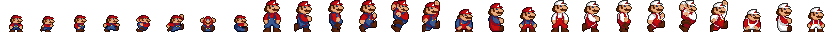
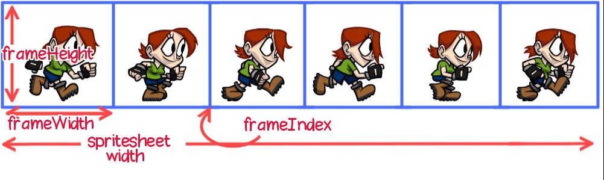
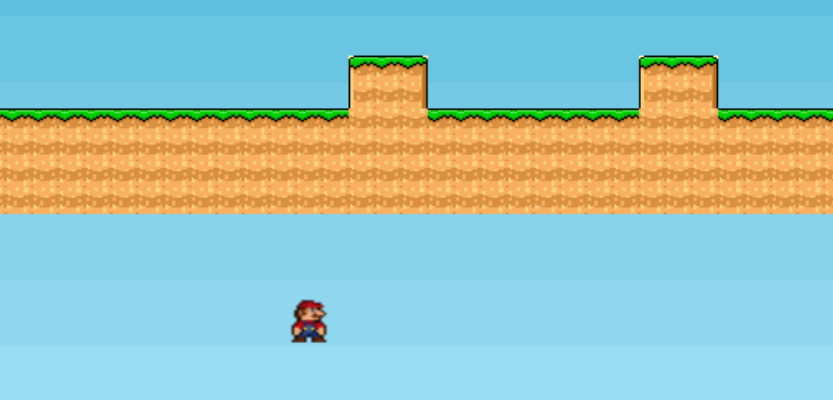

# PUNT 2. Afegint el jugador (player) i moviment

Ara ens caldrà afegir el jugador a la nostra escena

Primer de tot hem d'entendre com funcionen els sprites. Aquests són imatges tal com aquesta

<br/><br/>

Aquesta és una imatge que té unes dimensions de 832 x 32 (Width i Height)  i conté 26 imatges; per tant cadascuna té una mida de (832/26 =) 32 x 32

Això és important perquè les huarem de referenciar en algun moment. Observa la següent imatge que explica els paràmetres que necessitem

<br/><br/>


Al codi de la nostra escena afegirm ...

Al mètode **preload**:

```
this.load.spritesheet('mario',
          'assets/Mario.png',
          { frameWidth: 32, frameHeight: 32 }
      );

```
Observa que especifiquem la mida de cada frame, tal com hem calculat abans. Farà servir el primer sprite. Més endavant veurem com crear animacions

Al mètode **create**:

```
player = this.physics.add.sprite(280,200,'mario')
```

En aquest punt veurem que el sprite es queda penjant al cel. Ens cal afegir la gravetat; descomenta a **config** aquest apartat:

```
arcade: {
        gravity: { y: 300 }
      }
```

I en aquest punt ens caurà l'sprite fins a fora de la pantalla

<br/><br/>

Cal indicar-li a Phaser que el nostre player ha de colisionar amb la capa 'platform' de la nostra plataforma

```
platform_layer.setCollisionByExclusion([-1]);
this.physics.add.collider(player,platform_layer)
```

Observa a la documentació què fa la primera línia: [SetCollisionByExclusion](https://newdocs.phaser.io/docs/3.55.2/focus/Phaser.Tilemaps.Components.SetCollisionByExclusion)

La segona línia estableix que player i platform_layer no es poden travessar (colisionen)


## Afegint moviment


Aquesta secció l'hem de desenvolupar i hi ha moltes formes de dur-la a terme. T'animo a investigar

Al mètode **update** afegeix

```
var cursors = this.input.keyboard.createCursorKeys()

      if (cursors.left.isDown) {
        player.setVelocityX(-160)
      }
      else if (cursors.right.isDown) {
        player.setVelocityX(160)
      } 
      else {
        player.setVelocityX(0)
      }
      if (cursors.up.isDown) {

        player.setVelocityY(-180) 
      }
```
Recorda que el mètode update s'executa cíclicament i per tant és el lloc perfecte per a aquesta tasca. el codi és prou explicatiu per si mateix

## Animant els sprites

En aquest punt l'sprite del teu jugador és fix, i es mou a dreta o esquerra en mode 'Michael Jackson'. Anem a corregir-ho

- Al mètode **create**

A partir del nostre sprite creem l'animació; observa que les posicions 1 a 3 es corresponen al moviment cap a la dreta. En el teu cas, serà un altre

```
this.anims.create({
        key: 'right',
        frames: this.anims.generateFrameNumbers('mario', { start:1 , end:3 }),
        frameRate: 10,
        repeat: -1
      })
```

- Al mètode **update**

Quan es prem la tecla esquerra o dreta o estem aturats, engeguem l'animació adient

```
 if (cursors.left.isDown) {
        player.setVelocityX(-160)
        player.anims.play('left',true)
        
      }
```
## Afegint música i efectes sonors

És relativament fàcil . Per exemple, per posar una música en bucle, primer la carreguem a preload, i a create la posem en marxa:

- Al mètode **preload**

```
this.load.audio('bucle','assets/sounds/MarioBrosBucle.mp3')
```

- Al mètode **create**

```
  const music_bucle = this.sound.add('bucle')
  music_bucle.play({
      volume: 1,
      loop: true
  })
```

Si volem afegir efectes sonors, quan xoquem amb una moneda, impactem contra una caixa, etc, caldrà control·lar-ho al mètode update. Perexemple quan saltes, engegues l'efecte adient, amb bucle: false.


## Punt 2. Activitat  ***M6 M9***

- Adapta aquest exemples als teus sprites , fent que pugui recórrer tota l'escena, mostrant diferents animacions, quan va cap a l'esquerra, dreta o **quan salta**
- Cerca com fer que el jugador no surti dels límits de la pantalla. Quan cau per un forat huaríem d'evitar que travessés el mapa
- Cerca també com fer que quan el jugador cau sobre la plataforma, reboti lleugerament
- Quan el jugador salta, si seguim prement el cursor up, l'sprite puja de forma indefinida; busca una forma d'evitar això
- Quan el jugador salta, crea una animació diferent
- Afegeix la possibilitat de jugar amb les tecles AWD (esquerra, amunt, dreta) i saltar amb la barra espaiadora 
- Afegeix una música en bucle
- Afegeix efectes especials quan el jugador salta
- I per últim canvia l'animació quan el jugador caigui per un forat de la plataforma i arribi al fons


[Punt 3](PUNT3.md)

