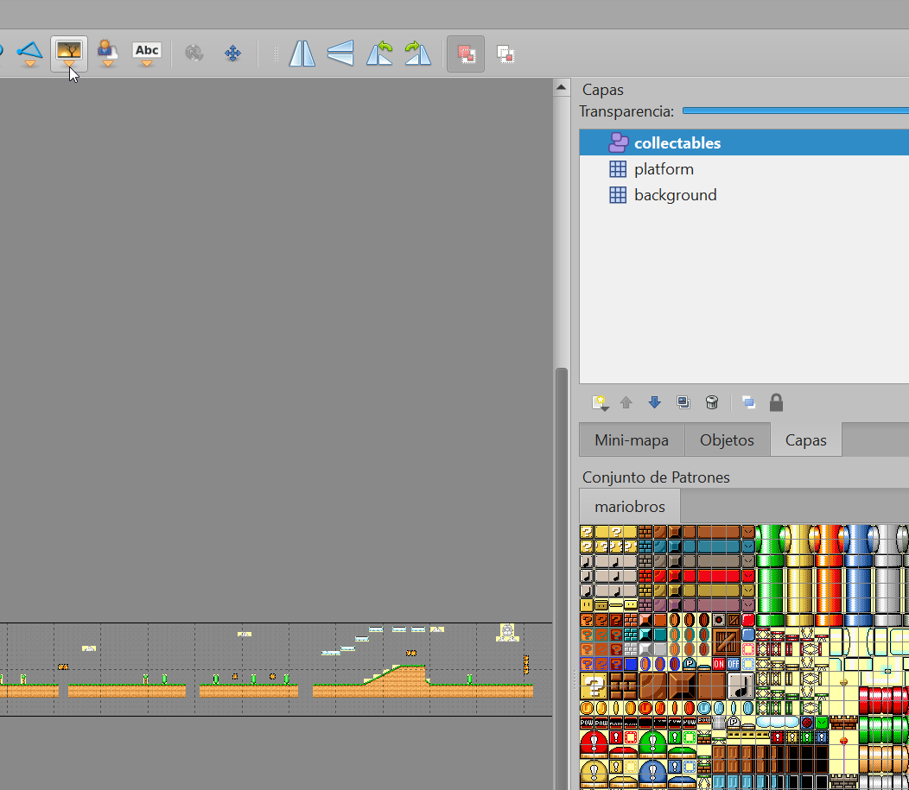

# PUNT 3. Afegint monedes i recolectant-les

Aquest apartat l'encararem de dues formes. La senzilla, i que trobaràs al tutorial oficial, [capítol 8](https://phaser.io/tutorials/making-your-first-phaser-3-game-spanish/part8), i la "complicada", que serà emprant Tiled i una capa d'objectes. 

La **primera** té dos avantatges:

- És l'adequat per a elements dinàmics (que apareixen o no  i en posicions diferents)
- De concepció senzilla

I un desavantatge:

-  Has d'anar "pintant" element a element, en la seva posició, amb codi

La **segona**, en canvi, té com a avantatge:

-  Utilitzes Tiled per a ubicar gràficament tots els elements, mitjançant una capa d'objectes

I com a desvantatge:

- Complexitat o corba d'aprenentatge més alta.
- Els elements han d'estar sempre en la mateixa posició


## El primer mètode

Llegeix bé el tutorial en aquest punt. El primera és entendre la diferència entre grups normal i grups estàtics. Els grups serveixen per a agrupar objectes amb una base en comú (monedes, estrelles, plataformes, que aquí no hem emprat, etc)

Els grups normals o dinàmics tenen física, per tant poden caure, moure's i els objectes els poden moure en xocar
Els grups estàtics, en canvi, no els afecta la física (no cauen. no xoquen, etc)

[Al punt 4 del tutorial oficial](https://phaser.io/tutorials/making-your-first-phaser-3-game-spanish/part4) en tens una explicació. Llegeix-la!

Comencem amb el nostre exemple de base: 

- A **preload**

Precarreguem les imatges:

```
this.load.image('estrella', 'assets/star.png')
this.load.image('bomba', 'assets/bomb.png')

```
- A **create**:

Creem un grup estàtic. Aquesta estrella no caurà, ni el nostre personatge hi xocarà. Quan plantegem enemics ja utilitzarem l'altre tipus de grup. També afegim les bombes però de dues formes diferents (en mode ilustratiu)

```
const estrelles = this.physics.add.staticGroup();
//...
estrelles.create(400,100,"estrella")
//...
  const bomba = this.physics.add.staticGroup({
    key: 'bomba',
    repeat: 11,
    //setXY: {
    //  x: 450,
    //  y: 110,
      //stepX: 70
    //},
  })
  // Comentar si setXY es descomenta
  bomba.children.iterate((bomb) => {
     bomb.setPosition(Phaser.Math.Between(500, 2500), Phaser.Math.Between(100,150));
  });
```
En el cas de la 'bomba' si s'estableix  setXY establim unes coordenades fixes amb un espai de separació. Amb setXY descomentat i el codi de sota descomentat establim unes coordenades aleatòries entre certs marges.

## El segon mètode. A través de Tiled i una mica de codi

El primer de tot és que ens cal crear una capa de d'objectes a Tiled

<br/><br/>

La capa d'objectes s'anomena collectables i se suposa que hi hem posat diferents objectes
Aquí afegirem un sprite animat, enlloc de la clàssica imatge. La capa només ens serveix per a marcar les ubicacions de tots els objectes, que podrem fer gràficament amb *Tiled* . Igualment haurem d'afegir la imatge i precarregar-la ja que no la podem obtenir , fàcilment, ds de la capa

- A **preload**:

```
this.load.spritesheet('moneda',
      'assets/monedes.png',
      { frameWidth: 16, frameHeight: 16, }
    );
```

- A **create**:

```
// Obtenim la capa
const collectables_layer = map.getObjectLayer('collectables')
// Creem un grup static on afegirem cada objecte de la capa
const collectables = this.physics.add.staticGroup()
// recorrem tots els objectes de la capa, creem sprite, l'afegim al grup i l'animen
collectables_layer.objects.forEach(moneda => {
    var spriteMoneda = this.add.sprite(moneda.x, moneda.y, 'moneda');
    collectables.add(spriteMoneda).setDepth(-1)
    this.anims.create({
        key: 'moneda',
        frames: this.anims.generateFrameNumbers('moneda', { start: 0, end: 3 }),
        frameRate: 10,
        repeat: -1
    })
    
    spriteMoneda.anims.play('moneda', true)
})
```

## Activitat 3

Com ja pots imaginar hauràs d'anar afegint objectes (tipis monedes, bombes, etc) al teu mapa. Emprant els dos mètodes i amb les dues variants del primer. Fes que aquests objectes estiguin sota del personatge, es a dir, quan passem per sobre que no es vegi al player pel darrera, sinó pel davant

Al següent punt treballarem les colisions


[Punt 4](PUNT4.md)