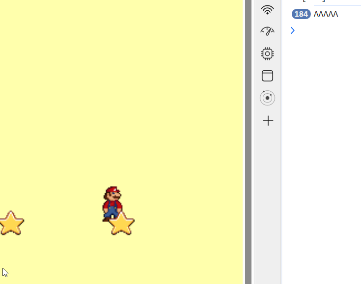

# PUNT 4. Afegint colisions

## Overlap amb l'estrella

 Començarem per l'estrella. el codi és molt senzill . Com que pertanyen a un grup estàtic utilitzarem "overlaps" (solapaments) enlloc de "collides" (coL·lisions). Reservarem aquest darrer per als enemics.

  <br/><br/>


Al (https://phaser.io/tutorials/making-your-first-phaser-3-game-spanish/part8)[tutorial, capítol 8] tens algun exemple

 - Al mètode **create**

```
const estrelles = this.physics.add.staticGroup();
estrelles.create(400,100,"estrella")
estrelles.create(500,100,"estrella")
estrelles.create(600,100,"estrella")

const onOverlapStar = (jugador,estel)=>{

    console.log("AAAAA")
    
}

this.physics.add.overlap(player, estrelles, onOverlapStar);

```

Però la gràcia està en fer-lo desaparéixer. Canviem el mètode onOverlapStar, que reb dos paràmetres (els objectes solapats)

```
 const onOverlapStar = (jugador,estel)=>{

  estel.disableBody(true, true);
  console.log("AAAAA")

    }
```

### Overlap amb les monedes


Aquest punt està menys documentat, però no és difícil. Possiblement hi hagi formes més eficients de fer-ho. Investiga i proposa una forma millor de fer-ho

Creem el mètode , diferent al de la moneda, ja que la forma de "destruir" l'sprite és diferent. Bàsicament fa invisible l'objecte i el destrueix. Curiosament, si no el fem invisible, tot i que el destruim, segueix essent visible.
```
const onOverlapLayer = (jugador,colleccionable)=>{
      colleccionable.visible=false
      colleccionable.body.destroy();
    }
```


## Activitat 4

Afegeix collecionables al teu videojoc. Fes-ne al menys de dos tipus. Monedes o similars que podrem . Reparteix al menys 15 col·leccionables, del tipus que siguin
